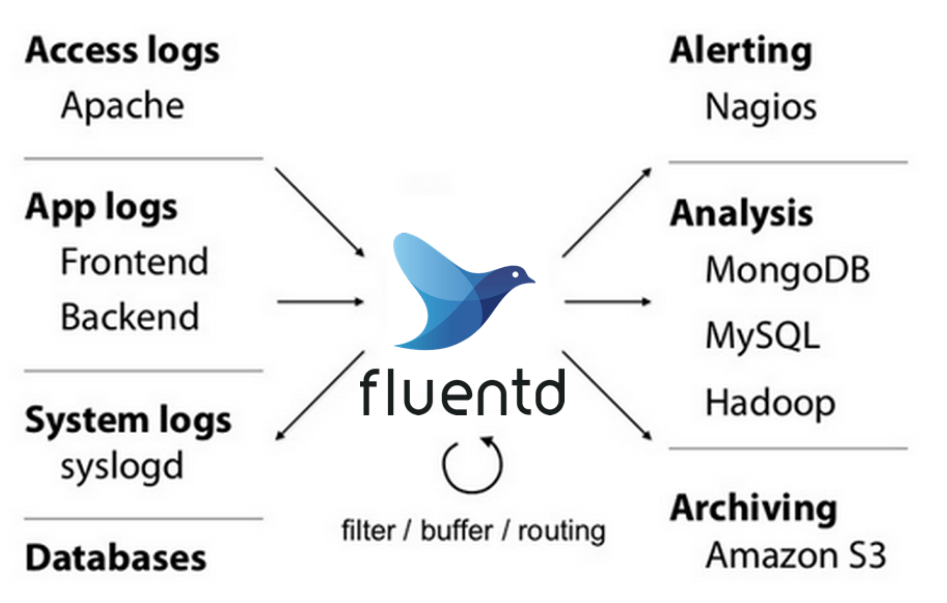
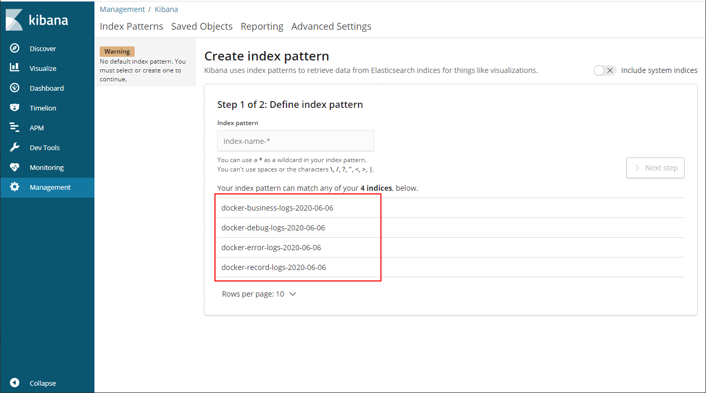
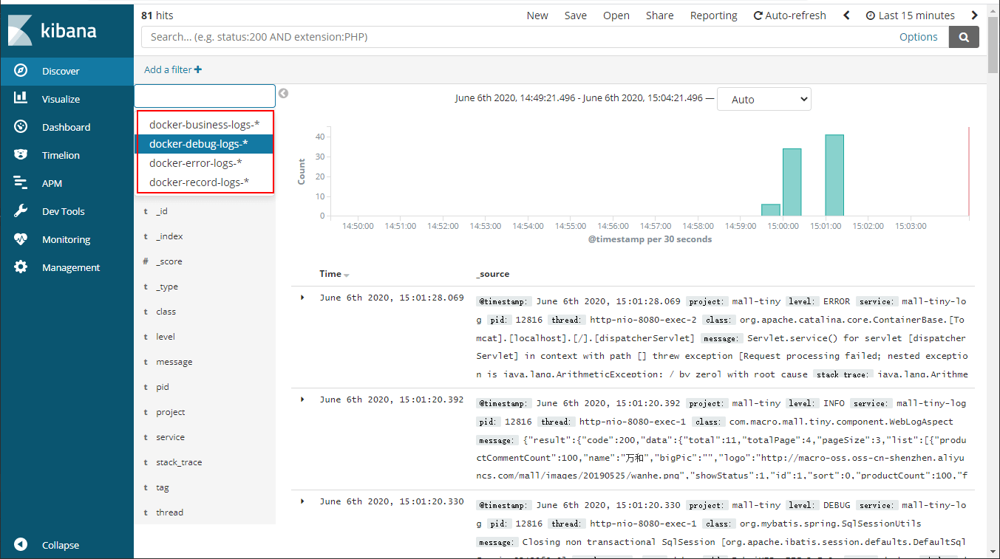

mall项目全套学习教程连载中，[关注公众号](#公众号)第一时间获取。

# 性能优越的轻量级日志收集工具，微软、亚马逊都在用！

> `ELK`日志收集系统大家都知道，但是还有一种日志收集系统`EFK`，肯定有很多朋友不知道！这里的`F`指的是`Fluentd`，它具有Logstash类似的日志收集功能，但是内存占用连Logstash的十分之一都不到，性能优越、非常轻巧。本文将详细介绍Fluentd的使用，主要用来收集SpringBoot应用的日志，希望对大家有所帮助！

## Fluentd 简介

Fluentd是一款开源的日志收集功能，致力于为用户搭建统一的日志收集层，和Elasticsearch、Kibana一起使用可以搭建EFK日志收集系统。什么是统一的日志收集层呢？看下下面这张图就清楚了！



## 安装

> 在[《你居然还去服务器上捞日志，搭个日志收集系统难道不香么！》](https://mp.weixin.qq.com/s/8nUunL02Y5AfXTCscYg54w)中已经介绍了ELK日志收集系统的搭建，这里就不再介绍Elasticsearch和Kibana的安装了，直接介绍Fluentd在Docker环境下的安装。

- 下载Fluentd的Docker镜像；

```bash
docker pull fluent/fluentd:v1.10
```

- 将默认配置`fluent.conf`文件复制到`/mydata/fluentd/`目录下，配置信息如下：

```
<source>
  @type  forward
  @id    input1
  @label @mainstream
  port  24224
</source>

<filter **>
  @type stdout
</filter>

<label @mainstream>
  <match docker.**>
    @type file
    @id   output_docker1
    path         /fluentd/log/docker.*.log
    symlink_path /fluentd/log/docker.log
    append       true
    time_slice_format %Y%m%d
    time_slice_wait   1m
    time_format       %Y%m%dT%H%M%S%z
  </match>
  <match **>
    @type file
    @id   output1
    path         /fluentd/log/data.*.log
    symlink_path /fluentd/log/data.log
    append       true
    time_slice_format %Y%m%d
    time_slice_wait   10m
    time_format       %Y%m%dT%H%M%S%z
  </match>
</label>
```

- 运行Fluentd服务，需要开放`24221~24224`四个端口用于接收不同类型的日志；

```bash
docker run -p 24221:24221 -p 24222:24222 -p 24223:24223 -p 24224:24224 --name efk-fluentd \
-v /mydata/fluentd/log:/fluentd/log \
-v /mydata/fluentd/fluent.conf:/fluentd/etc/fluent.conf \
-d fluent/fluentd:v1.10
```

- 第一次启动可能会失败，修改目录权限后重新启动即可；

```bash
chmod 777 /mydata/fluentd/log/
```

- 使用`root`用户进入Fluentd容器内部；

```bash
docker exec -it --user root efk-fluentd /bin/sh
```

- 安装Fluentd的Elasticsearch插件；

```bash
fluent-gem install fluent-plugin-elasticsearch
```

- 如果你依然想使用`docker-compose`一次性安装EFK的话，可以使用如下脚本，`注意`使用`user:root`启动就不需要再修改目录权限了！

```yaml
version: '3'
services:
  elasticsearch:
    image: elasticsearch:6.4.0
    container_name: efk-elasticsearch
    user: root
    environment:
      - "cluster.name=elasticsearch" #设置集群名称为elasticsearch
      - "discovery.type=single-node" #以单一节点模式启动
      - "ES_JAVA_OPTS=-Xms512m -Xmx512m" #设置使用jvm内存大小
      - TZ=Asia/Shanghai
    volumes:
      - /mydata/elasticsearch/plugins:/usr/share/elasticsearch/plugins #插件文件挂载
      - /mydata/elasticsearch/data:/usr/share/elasticsearch/data #数据文件挂载
    ports:
      - 9200:9200
      - 9300:9300
  kibana:
    image: kibana:6.4.0
    container_name: efk-kibana
    links:
      - elasticsearch:es #可以用es这个域名访问elasticsearch服务
    depends_on:
      - elasticsearch #kibana在elasticsearch启动之后再启动
    environment:
      - "elasticsearch.hosts=http://es:9200" #设置访问elasticsearch的地址
      - TZ=Asia/Shanghai
    ports:
      - 5601:5601
  fluentd:
    image: fluent/fluentd:v1.10
    container_name: efk-fluentd
    user: root
    environment:
      - TZ=Asia/Shanghai
    volumes:
      - /mydata/fluentd/log:/fluentd/log
      - /mydata/fluentd/fluent.conf:/fluentd/etc/fluent.conf
    depends_on:
      - elasticsearch #kibana在elasticsearch启动之后再启动
    links:
      - elasticsearch:es #可以用es这个域名访问elasticsearch服务
    ports:
      - 24221:24221
      - 24222:24222
      - 24223:24223
      - 24224:24224
```

- 使用新的配置文件`fluent.conf`替换原来的配置文件，然后重新启动Fluentd服务，新的配置文件会在下面给出。

## Fluentd配置详解

> 接下来我们来介绍下Fluentd配置文件如何配置，先放出完全配置，然后我们对里面的一些配置要点进行详细说明。

### 完全配置

```
<source>
  @type  tcp
  @id    debug-input
  port  24221
  tag debug
  <parse>
	@type json
  </parse>
</source>

<source>
  @type  tcp
  @id    error-input
  port  24222
  tag error
  <parse>
	@type json
  </parse>
</source>

<source>
  @type  tcp
  @id    business-input
  port  24223
  tag business
  <parse>
	@type json
  </parse>
</source>

<source>
  @type  tcp
  @id    record-input
  port  24224
  tag record
  <parse>
	@type json
  </parse>
</source>

<filter record>
  @type parser
  key_name message
  reserve_data true
  remove_key_name_field true
  <parse>
    @type json
  </parse>
</filter>

<match fluent.**>
  @type stdout
  output_type json
</match>

<match **>
  @type elasticsearch
  host 192.168.3.101
  port 9200
  type_name docker
  logstash_format true
  logstash_prefix docker-${tag}-logs
  logstash_dateformat %Y-%m-%d
  flush_interval 5s
  include_tag_key true
</match>
```

### 配置要点解析

#### `<source>`

> 定义了日志收集的来源，可以有tcp、udp、tail（文件）、forward（tcp+udp）、http等方式。

这里我们从tcp请求收集日志，端口为`24221`，并且设置了tag为`debug`。

```
<source>
  @type  tcp
  @id    debug-input
  port  24221
  tag debug
  <parse>
	@type json
  </parse>
</source>
```

#### `<parse>`

> 定义对原始数据的解析方式，可以将日志转化为JSON。

比如我们将debug日志转化为JSON可以进行如下配置。

```
<source>
  @type  tcp
  @id    debug-input
  port  24221
  tag debug
  <parse>
	@type json
  </parse>
</source>
```

#### `<filter>`

> 可以对收集的日志进行一系列的处理，比如说将日志打印到控制台或者对日志进行解析。

将所有日志打印到控制台的配置：

```
<filter **>
  @type stdout
</filter>
```

对于tag为`record`来源的日志，我们将其中的`message`属性转化为JSON格式，如果不进行转化的话，`message`属性将会是一个字符串。

```
<filter record>
  @type parser
  key_name message
  reserve_data true
  remove_key_name_field true
  <parse>
    @type json
  </parse>
</filter>
```

#### `<match>`

> 定义了收集到的日志最后输出到哪里，可以输出到stdout（控制台）、file、elasticsearch、mongo等里面。

这里我们使用`elasticsearch`来存储日志信息，`logstash_format`、`logstash_prefix`、`logstash_dateformat`主要用来控制日志索引名称的生成，当前配置生成debug日志的索引格式为`docker-debug-logs-2020-06-03`，`flush_interval`用来控制日志输出到elasticsearch的时间间隔。

```
<match **>
  @type elasticsearch
  host 192.168.3.101
  port 9200
  type_name docker
  logstash_format true
  logstash_prefix docker-${tag}-logs
  logstash_dateformat %Y-%m-%d
  flush_interval 5s
  include_tag_key true
</match>
```

### 替换配置文件

替换掉原来的`/mydata/fluentd/fluent.conf`配置文件，然后再重新启动服务，我们的Fluentd服务就可以开始收集日志了。

```bash
docekr restart efk-fluentd
```

## 结合SpringBoot使用

> 其实Fluentd收集日志的原理和Logstash一样，都是通过tcp端口来收集日志，所以我们只要把logback配置文件中原来Logstash日志收集地址端口改为Fluentd的即可。

- 修改`logback-spring.xml`配置文件；

```xml
<!--DEBUG日志输出到LogStash-->
<appender name="LOG_STASH_DEBUG" class="net.logstash.logback.appender.LogstashTcpSocketAppender">
    <destination>${LOG_STASH_HOST}:24221</destination>
</appender>

<!--ERROR日志输出到LogStash-->
<appender name="LOG_STASH_ERROR" class="net.logstash.logback.appender.LogstashTcpSocketAppender">
    <destination>${LOG_STASH_HOST}:24222</destination>
</appender>

<!--业务日志输出到LogStash-->
<appender name="LOG_STASH_BUSINESS" class="net.logstash.logback.appender.LogstashTcpSocketAppender">
    <destination>${LOG_STASH_HOST}:24223</destination>
</appender>

<!--接口访问记录日志输出到LogStash-->
<appender name="LOG_STASH_RECORD" class="net.logstash.logback.appender.LogstashTcpSocketAppender">
    <destination>${LOG_STASH_HOST}:24224</destination>
</appender>
```

- 如果你的Fluentd不是部署在原来Logstash的服务器上，还需要修改`application-dev.yml`配置中的`logstash.host`属性。

```yaml
logstash:
  host: localhost
```

- 启动并运行我们的SpringBoot应用。

## Kibana中查看日志

> 至此我们的EFK日志收集系统搭建完成了，只需在Kibana中使用即可。

- 在`Management->Kibana->Index Patterns`中可以创建`Index Patterns`，Kibana服务访问地址：http://192.168.3.101:5601



- 创建完成后查看日志，可以看出该日志收集功能和我们之前搭建的ELK系统完全相同。



## Logstash vs Fluentd

> 接下来我们来对这两个日志收集工具的各个方面做个对比。

| 对比方面       | Logstash                       | Fluentd                    |
| -------------- | ------------------------------ | -------------------------- |
| 内存占用       | 启动1G左右                     | 启动60M左右                |
| CPU占用        | 较高                           | 较低                       |
| 支持插件       | 丰富                           | 丰富                       |
| 通用日志解析   | 支持grok（基于正则表达式）解析 | 支持正则表达式解析         |
| 特定日志类型   | 支持JSON等主流格式             | 支持JSON等主流格式         |
| 数据过滤       | 支持                           | 支持                       |
| 数据buffer发送 | 插件支持                       | 插件支持                   |
| 运行环境       | JRuby实现，依赖JVM环境         | CRuby、C实现，依赖Ruby环境 |
| 线程支持       | 支持多线程                     | 多线程受GIL限制            |

## 参考资料

官方文档：https://docs.fluentd.org/

## 项目源码地址

https://github.com/macrozheng/mall-learning/tree/master/mall-tiny-log

## 公众号

