mall项目全套学习教程连载中，[关注公众号](#公众号)第一时间获取。

# Elasticsearch官方已支持SQL查询，用起来贼方便！

> 平时使用Elasticsearch的时候，偶尔会在Kibana中使用Query DSL来查询数据。每次要用到Query DSL时都基本忘光了，需要重新在回顾一遍，最近发现Elasticsearch已经支持SQL查询了（6.3版本以后），整理了下其用法，希望对大家有所帮助！

## 简介

Elasticsearch SQL是一个X-Pack组件，它允许针对Elasticsearch实时执行类似SQL的查询。无论使用REST接口，命令行还是JDBC，任何客户端都可以使用SQL对Elasticsearch中的数据进行原生搜索和聚合数据。可以将Elasticsearch SQL看作是一种翻译器，它可以将SQL翻译成Query DSL。

Elasticsearch SQL具有如下特性：

- 原生支持：Elasticsearch SQL是专门为Elasticsearch打造的。
- 没有额外的零件：无需其他硬件，处理器，运行环境或依赖库即可查询Elasticsearch，Elasticsearch SQL直接在Elasticsearch内部运行。
- 轻巧高效：Elasticsearch SQL并未抽象化其搜索功能，相反的它拥抱并接受了SQL来实现全文搜索，以简洁的方式实时运行全文搜索。
          

## 学前准备

学习之前我们需要先对Elasticsearch有所了解，并安装好Elasticsearch和Kibana，这里安装的是7.6.2版本，具体可以参考[《Elasticsearch快速入门，掌握这些刚刚好！》](https://mp.weixin.qq.com/s/cohWZy_eUOUqbmUxhXzzNA)。

安装完成后在Kibana中导入测试数据，数据地址： https://github.com/macrozheng/mall-learning/blob/master/document/json/accounts.json

直接在Kibana的Dev Tools中运行如下命令即可：

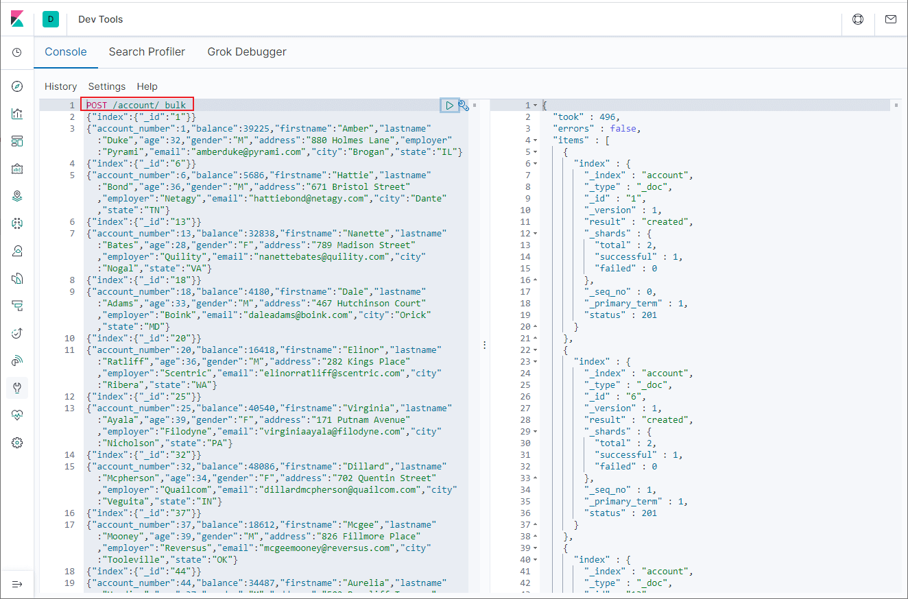

## 第一个SQL查询

我们使用SQL来查询下前10条记录，可以通过`format`参数控制返回结果的格式，txt表示文本格式，看起来更直观点，默认为json格式。

在Kibana的Console中输入如下命令：

```
POST /_sql?format=txt
{
  "query": "SELECT account_number,address,age,balance FROM account LIMIT 10"
}
```

查询结果显示如下。

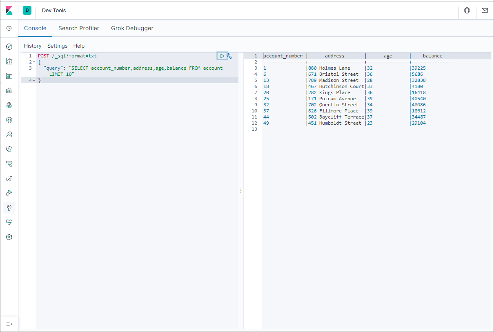

## 将SQL转化为DSL

当我们需要使用Query DSL时，也可以先使用SQL来查询，然后通过Translate API转换即可。

例如我们翻译以下查询语句：

```
POST /_sql/translate
{
  "query": "SELECT account_number,address,age,balance FROM account WHERE age>32 LIMIT 10"
}
```

最终获取到Query DSL结果如下。

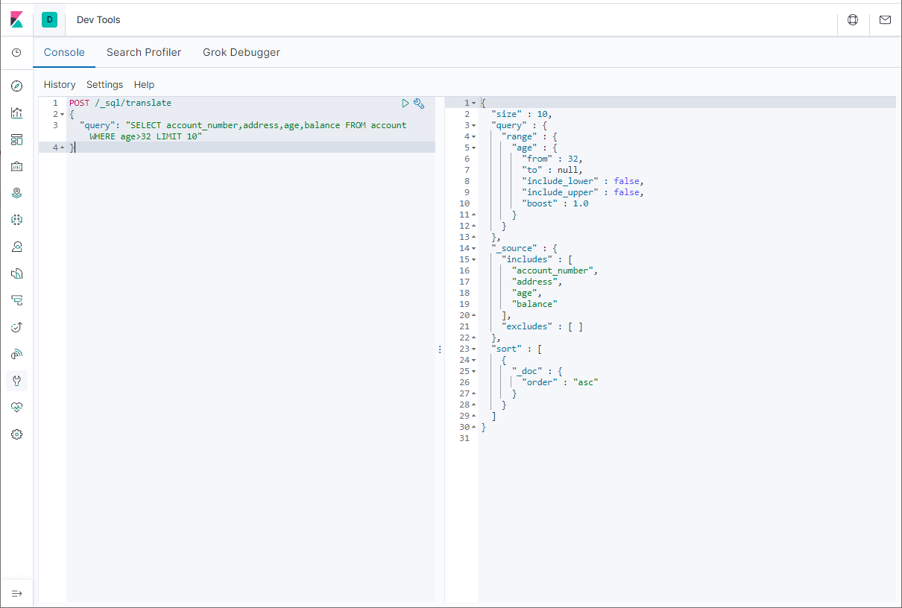

## SQL和DSL混合使用

我们还可以将SQL和Query DSL混合使用，比如使用Query DSL来设置过滤条件。

例如查询age在30-35之间的记录，可以使用如下查询语句：

```
POST /_sql?format=txt
{
  "query": "SELECT account_number,address,age,balance FROM account",
      "filter": {
        "range": {
            "age": {
                "gte" : 30,
                "lte" : 35
            }
        }
    },
    "fetch_size": 10
}
```

查询结果展示如下：

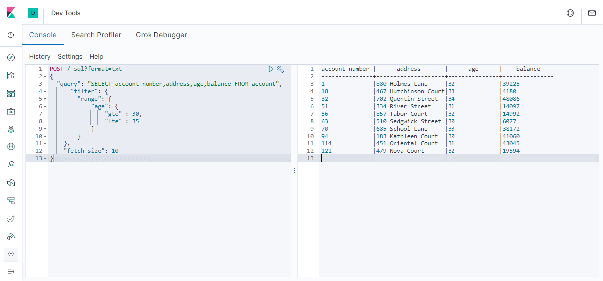

## SQL和ES对应关系

| SQL    | ES       | 描述                               |
| ------ | -------- | ---------------------------------- |
| column | field    | 数据库中表的字段与ES中的属性对应  |
| row    | document | 数据库表中的行记录与ES中的文档对应   |
| table  | index    | 数据库中的表与ES中的索引对应       |

## 常用SQL操作

### 语法

在ES中使用SQL查询的语法与在数据库中使用基本一致，具体格式如下：

```sql
SELECT select_expr [, ...]
[ FROM table_name ]
[ WHERE condition ]
[ GROUP BY grouping_element [, ...] ]
[ HAVING condition]
[ ORDER BY expression [ ASC | DESC ] [, ...] ]
[ LIMIT [ count ] ]
[ PIVOT ( aggregation_expr FOR column IN ( value [ [ AS ] alias ] [, ...] ) ) ]
```

### WHERE

可以使用`WHERE`语句设置查询条件，比如查询state字段为VA的记录，查询语句如下。

```
POST /_sql?format=txt
{
  "query": "SELECT account_number,address,age,balance,state FROM account WHERE state='VA' LIMIT 10 "
}
```

查询结果展示如下：

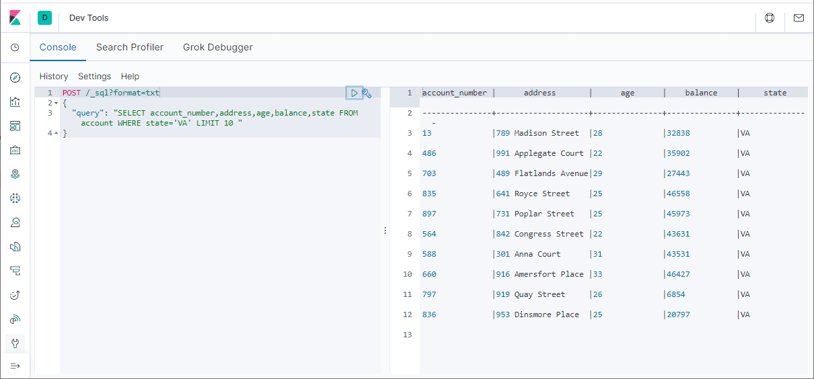

### GROUP BY

我们可以使用`GROUP BY`语句对数据进行分组，统计出分组记录数量，最大age和平均balance等信息，查询语句如下。

```
POST /_sql?format=txt
{
  "query": "SELECT state,COUNT(*),MAX(age),AVG(balance) FROM account GROUP BY state LIMIT 10"
}
```

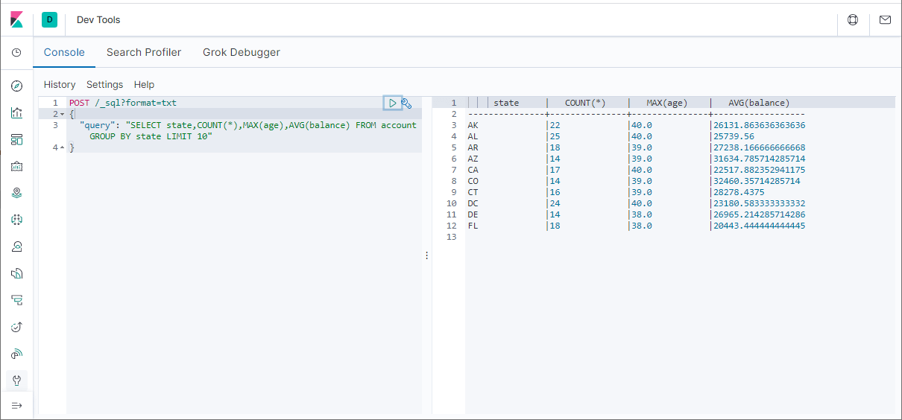

### HAVING

我们可以使用`HAVING`语句对分组数据进行二次筛选，比如筛选分组记录数量大于15的信息，查询语句如下。

```
POST /_sql?format=txt
{
  "query": "SELECT state,COUNT(*),MAX(age),AVG(balance) FROM account GROUP BY state HAVING COUNT(*)>15 LIMIT 10"
}
```

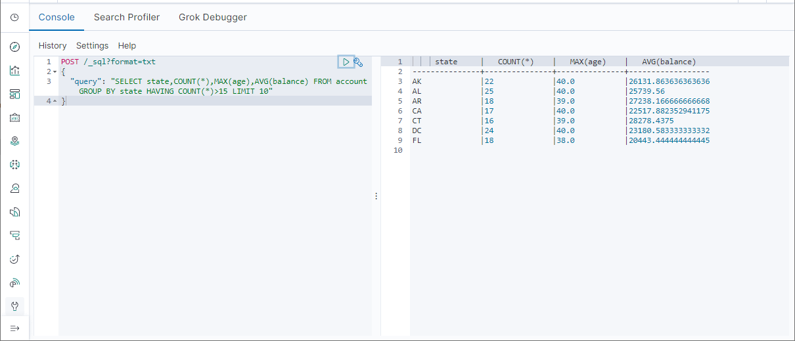

### ORDER BY

我们可以使用`ORDER BY`语句对数据进行排序，比如按照balance字段从高到低排序，查询语句如下。

```
POST /_sql?format=txt
{
  "query": "SELECT account_number,address,age,balance,state FROM account ORDER BY balance DESC LIMIT 10 "
}
```

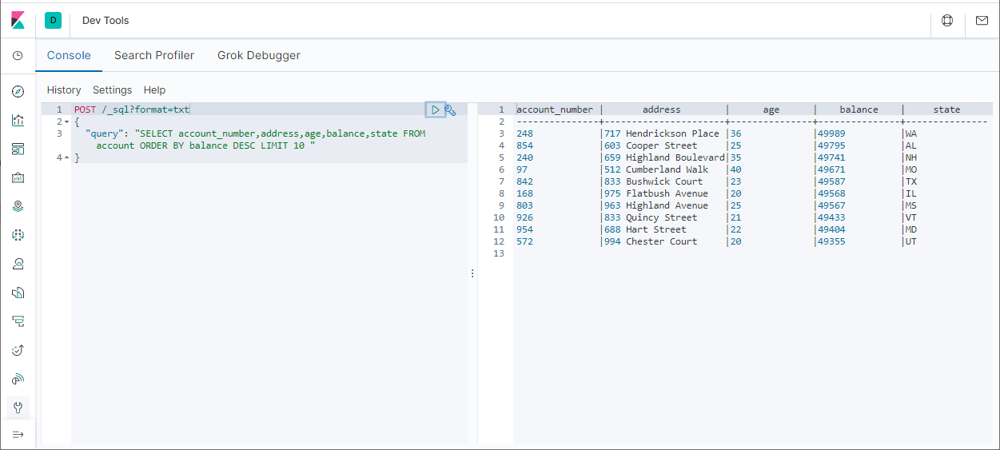

### DESCRIBE

我们可以使用`DESCRIBE`语句查看表（ES中为索引）中有哪些字段，比如查看account表的字段，查询语句如下。

```
POST /_sql?format=txt
{
  "query": "DESCRIBE account"
}
```

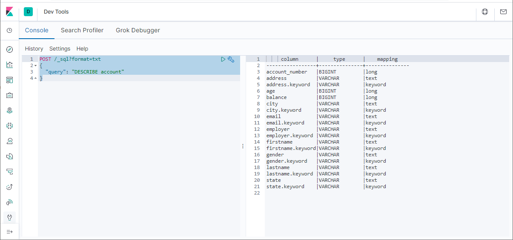

### SHOW TABLES

我们可以使用`SHOW TABLES`查看所有的表（ES中为索引）。

```
POST /_sql?format=txt
{
  "query": "SHOW TABLES"
}
```

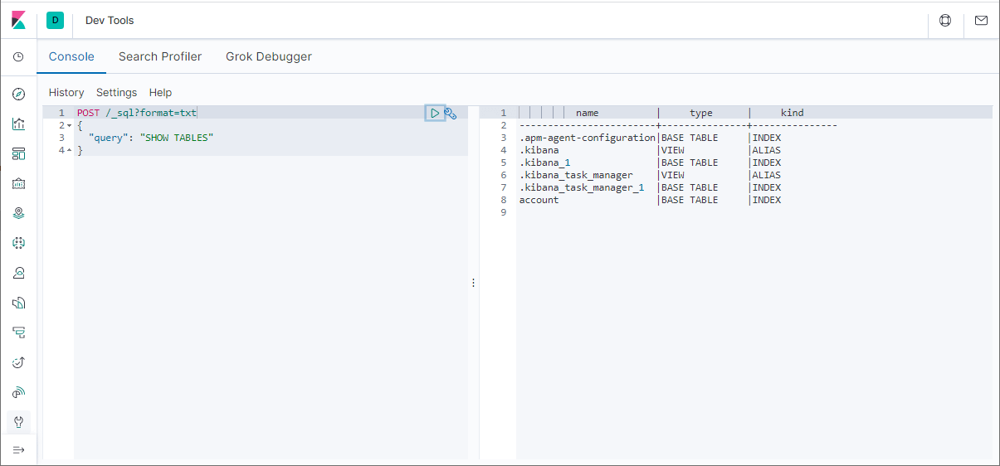

## 支持的函数

使用SQL查询ES中的数据，不仅可以使用一些SQL中的函数，还可以使用一些ES中特有的函数。

### 查询支持的函数

我们可以使用`SHOW FUNCTIONS`语句查看所有支持的函数，比如搜索所有带有`DATE`字段的函数可以使用如下语句。

```
POST /_sql?format=txt
{
  "query": "SHOW FUNCTIONS LIKE '%DATE%'"
}
```

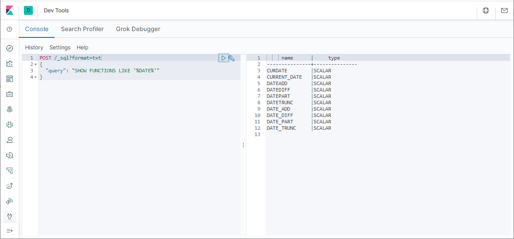

### 全文搜索函数

全文搜索函数是ES中特有的，当使用`MATCH`或`QUERY`函数时，会启用全文搜索功能，`SCORE`函数可以用来统计搜索评分。

#### MATCH()

使用`MATCH`函数查询address中包含Street的记录。

```
POST /_sql?format=txt
{
  "query": "SELECT account_number,address,age,balance,SCORE() FROM account WHERE MATCH(address,'Street') LIMIT 10"
}
```

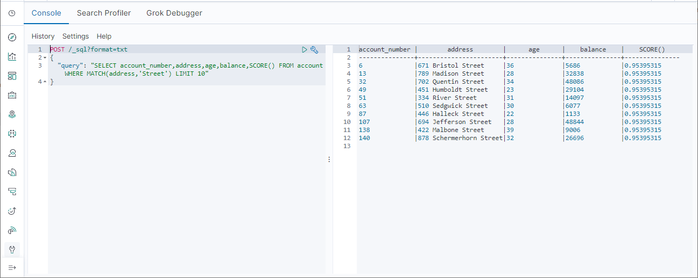

#### QUERY()

使用`QUERY`函数查询address中包含Street的记录。

```
POST /_sql?format=txt
{
  "query": "SELECT account_number,address,age,balance,SCORE() FROM account WHERE QUERY('address:Street') LIMIT 10"
}
```

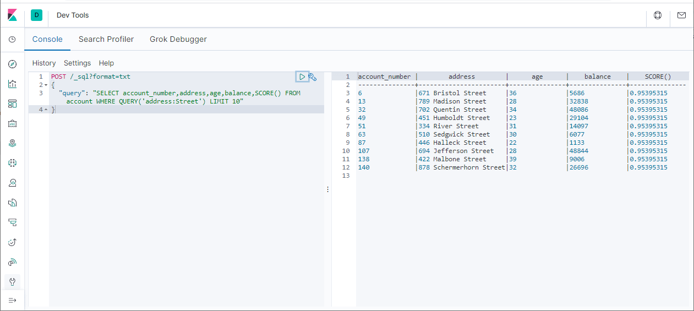

## SQL CLI

如果你不想使用Kibana来使用ES SQL的话，也可以使用ES自带的SQL CLI来查询，该命令位于ES的bin目录下。

使用如下命令启动SQL CLI：

```bash
elasticsearch-sql-cli http://localhost:9200
```


然后直接输入SQL命令即可查询了，注意要加分号。

```sql
SELECT account_number,address,age,balance FROM account LIMIT 10;
```


## 局限性

使用SQL查询ES有一定的局限性，没有原生的Query DSL那么强大，对于嵌套属性和某些函数的支持并不怎么好，但是平时用来查询下数据基本够用了。

## 参考资料

官方文档：https://www.elastic.co/guide/en/elasticsearch/reference/7.6/xpack-sql.html

## 公众号

