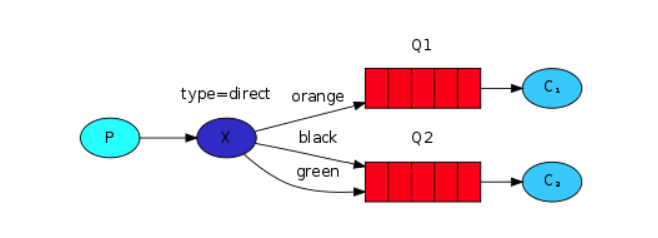
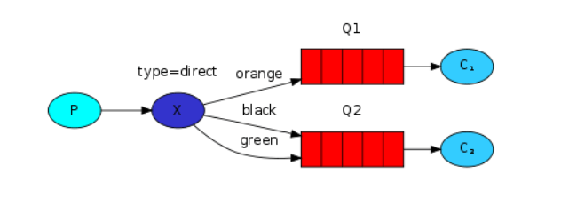
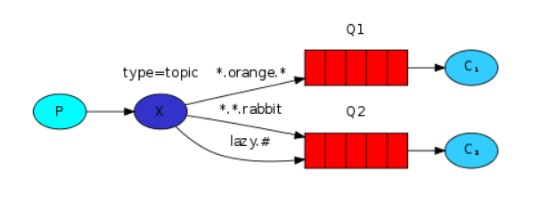

mall项目全套学习教程连载中，[关注公众号](#公众号)第一时间获取。

# 连RabbitMQ的5种核心消息模式都不懂，也敢说自己会用消息队列！

> 以前看过的关于RabbitMQ核心消息模式的文章都是基于Java API的，最近看了下官方文档，发现这些核心消息模式都可以通过Spring AMQP来实现。于是总结了下RabbitMQ的核心知识点，包括RabbitMQ在Windows和Linux下的安装、5种核心消息模式的Spring AMQP实现，相信对于想要学习和回顾RabbitMQ的朋友都会有所帮助。

## 简介

RabbitMQ是最受欢迎的开源消息中间件之一，在全球范围内被广泛应用。RabbitMQ是轻量级且易于部署的，能支持多种消息协议。RabbitMQ可以部署在分布式系统中，以满足大规模、高可用的要求。

## 相关概念

我们先来了解下RabbitMQ中的相关概念，这里以5种消息模式中的`路由模式`为例。



标志 | 中文名 | 英文名| 描述
----|----|----|----
P	|生产者	|Producer |消息的发送者，可以将消息发送到交换机
C	|消费者	|Consumer |消息的接收者，从队列中获取消息并进行消费
X	|交换机	|Exchange |接收生产者发送的消息，并根据路由键发送给指定队列
Q	|队列	|Queue |存储从交换机发来的消息
type | 交换机类型 |type | 不同类型的交换机转发消息方式不同
fanout | 发布/订阅模式 |fanout | 广播消息给所有绑定交换机的队列
direct | 路由模式 |direct | 根据路由键发送消息
topic | 通配符模式 |topic | 根据路由键的匹配规则发送消息

## 安装及配置

> 接下来我们介绍下RabbitMQ的安装和配置，提供Windows和Linux两种安装方式。

### Windows下的安装

- 安装Erlang，下载地址：http://erlang.org/download/otp_win64_21.3.exe


- 安装RabbitMQ，下载地址：https://dl.bintray.com/rabbitmq/all/rabbitmq-server/3.7.14/rabbitmq-server-3.7.14.exe


- 安装完成后，进入RabbitMQ安装目录下的sbin目录；


- 在地址栏输入cmd并回车启动命令行，然后输入以下命令启动管理功能。

```
rabbitmq-plugins enable rabbitmq_management
```


### Linux下的安装

- 下载`rabbitmq 3.7.15`的Docker镜像；

```bash
docker pull rabbitmq:3.7.15
```

- 使用Docker命令启动服务；

```bash
docker run -p 5672:5672 -p 15672:15672 --name rabbitmq \
-d rabbitmq:3.7.15
```

- 进入容器并开启管理功能；

```bash
docker exec -it rabbitmq /bin/bash
rabbitmq-plugins enable rabbitmq_management
```


- 开启防火墙便于外网访问。

```bash
firewall-cmd --zone=public --add-port=15672/tcp --permanent
firewall-cmd --zone=public --add-port=5672/tcp --permanent
firewall-cmd --reload
```

### 访问及配置

- 访问RabbitMQ管理页面地址，查看是否安装成功（Linux下使用服务器IP访问即可）：http://localhost:15672/


- 输入账号密码并登录，这里使用默认账号密码登录：guest guest

- 创建帐号并设置其角色为管理员：mall mall


- 创建一个新的虚拟host为：/mall


- 点击mall用户进入用户配置页面；


- 给mall用户配置该虚拟host的权限；


- 至此，RabbitMQ的配置完成。

## 5种消息模式

> 这5种消息模式是构建基于RabbitMQ的消息应用的基础，一定要牢牢掌握它们。学过RabbitMQ的朋友应该了解过这些消息模式的Java实现，这里我们使用Spring AMQP的形式来实现它们。

### 简单模式

> 简单模式是最简单的消息模式，它包含一个生产者、一个消费者和一个队列。生产者向队列里发送消息，消费者从队列中获取消息并消费。

#### 模式示意图


#### Spring AMQP实现

- 首先需要在`pom.xml`中添加Spring AMQP的相关依赖；

```xml
<!--Spring AMQP依赖-->
<dependency>
    <groupId>org.springframework.boot</groupId>
    <artifactId>spring-boot-starter-amqp</artifactId>
</dependency>
```

- 然后修改`application.yml`，添加RabbitMQ的相关配置；

```yaml
spring:
  rabbitmq:
    host: localhost
    port: 5672
    virtual-host: /mall
    username: mall
    password: mall
    publisher-confirms: true #消息发送到交换器确认
    publisher-returns: true #消息发送到队列确认
```

- 添加`简单模式`相关Java配置，创建一个名为`simple.hello`的队列、一个生产者和一个消费者；

```java
/**
 * Created by macro on 2020/5/19.
 */
@Configuration
public class SimpleRabbitConfig {

	@Bean
	public Queue hello() {
		return new Queue("simple.hello");
	}

	@Bean
	public SimpleSender simpleSender(){
		return new SimpleSender();
	}

	@Bean
	public SimpleReceiver simpleReceiver(){
		return new SimpleReceiver();
	}

}
```

- 生产者通过`send方法`向队列`simple.hello`中发送消息；

```java
/**
 * Created by macro on 2020/5/19.
 */
public class SimpleSender {

	private static final Logger LOGGER = LoggerFactory.getLogger(SimpleSender.class);

	@Autowired
	private RabbitTemplate template;

	private static final String queueName="simple.hello";

	public void send() {
		String message = "Hello World!";
		this.template.convertAndSend(queueName, message);
		LOGGER.info(" [x] Sent '{}'", message);
	}

}
```

- 消费者从队列`simple.hello`中获取消息；

```java
/**
 * Created by macro on 2020/5/19.
 */
@RabbitListener(queues = "simple.hello")
public class SimpleReceiver {

    private static final Logger LOGGER = LoggerFactory.getLogger(SimpleReceiver.class);

    @RabbitHandler
    public void receive(String in) {
        LOGGER.info(" [x] Received '{}'", in);
    }

}
```

- 在controller中添加测试接口，调用该接口开始发送消息；

```java
/**
 * Created by macro on 2020/5/19.
 */
@Api(tags = "RabbitController", description = "RabbitMQ功能测试")
@Controller
@RequestMapping("/rabbit")
public class RabbitController {

    @Autowired
    private SimpleSender simpleSender;

    @ApiOperation("简单模式")
    @RequestMapping(value = "/simple", method = RequestMethod.GET)
    @ResponseBody
    public CommonResult simpleTest() {
        for(int i=0;i<10;i++){
            simpleSender.send();
            ThreadUtil.sleep(1000);
        }
        return CommonResult.success(null);
    }
}
```

- 运行后结果如下，可以发现生产者往队列中发送消息，消费者从队列中获取消息并消费。


### 工作模式

> 工作模式是指向多个互相竞争的消费者发送消息的模式，它包含一个生产者、两个消费者和一个队列。两个消费者同时绑定到一个队列上去，当消费者获取消息处理耗时任务时，空闲的消费者从队列中获取并消费消息。

#### 模式示意图


#### Spring AMQP实现

- 添加`工作模式`相关Java配置，创建一个名为`work.hello`的队列、一个生产者和两个消费者；

```java
/**
 * Created by macro on 2020/5/19.
 */
@Configuration
public class WorkRabbitConfig {

    @Bean
    public Queue workQueue() {
        return new Queue("work.hello");
    }

    @Bean
    public WorkReceiver workReceiver1() {
        return new WorkReceiver(1);
    }

    @Bean
    public WorkReceiver workReceiver2() {
        return new WorkReceiver(2);
    }

    @Bean
    public WorkSender workSender() {
        return new WorkSender();
    }

}
```

- 生产者通过`send方法`向队列`work.hello`中发送消息，消息中包含一定数量的`.`号；

```java
/**
 * Created by macro on 2020/5/19.
 */
public class WorkSender {

    private static final Logger LOGGER = LoggerFactory.getLogger(WorkSender.class);

    @Autowired
    private RabbitTemplate template;

    private static final String queueName = "work.hello";

    public void send(int index) {
        StringBuilder builder = new StringBuilder("Hello");
        int limitIndex = index % 3+1;
        for (int i = 0; i < limitIndex; i++) {
            builder.append('.');
        }
        builder.append(index+1);
        String message = builder.toString();
        template.convertAndSend(queueName, message);
        LOGGER.info(" [x] Sent '{}'", message);
    }

}
```

- 两个消费者从队列`work.hello`中获取消息，名称分别为`instance 1`和`instance 2`，消息中包含`.`号越多，耗时越长；

```java
/**
 * Created by macro on 2020/5/19.
 */
@RabbitListener(queues = "work.hello")
public class WorkReceiver {

    private static final Logger LOGGER = LoggerFactory.getLogger(WorkReceiver.class);

    private final int instance;

    public WorkReceiver(int i) {
        this.instance = i;
    }

    @RabbitHandler
    public void receive(String in) {
        StopWatch watch = new StopWatch();
        watch.start();
        LOGGER.info("instance {} [x] Received '{}'", this.instance, in);
        doWork(in);
        watch.stop();
        LOGGER.info("instance {} [x] Done in {}s", this.instance, watch.getTotalTimeSeconds());
    }

    private void doWork(String in) {
        for (char ch : in.toCharArray()) {
            if (ch == '.') {
                ThreadUtil.sleep(1000);
            }
        }
    }

}
```

- 在controller中添加测试接口，调用该接口开始发送消息；

```java
/**
 * Created by macro on 2020/5/19.
 */
@Api(tags = "RabbitController", description = "RabbitMQ功能测试")
@Controller
@RequestMapping("/rabbit")
public class RabbitController {
    
    @Autowired
    private WorkSender workSender;

    @ApiOperation("工作模式")
    @RequestMapping(value = "/work", method = RequestMethod.GET)
    @ResponseBody
    public CommonResult workTest() {
        for(int i=0;i<10;i++){
            workSender.send(i);
            ThreadUtil.sleep(1000);
        }
        return CommonResult.success(null);
    }
}
```

- 运行后结果如下，可以发现生产者往队列中发送包含不同数量`.`号的消息，`instance 1`和`instance 2`消费者互相竞争，分别消费了一部分消息。


### 发布/订阅模式

> 发布/订阅模式是指同时向多个消费者发送消息的模式（类似广播的形式），它包含一个生产者、两个消费者、两个队列和一个交换机。两个消费者同时绑定到不同的队列上去，两个队列绑定到交换机上去，生产者通过发送消息到交换机，所有消费者接收并消费消息。

#### 模式示意图


#### Spring AMQP实现

- 添加`发布/订阅模式`相关Java配置，创建一个名为`exchange.fanout`的交换机、一个生产者、两个消费者和两个匿名队列，将两个匿名队列都绑定到交换机；

```java
/**
 * Created by macro on 2020/5/19.
 */
@Configuration
public class FanoutRabbitConfig {

    @Bean
    public FanoutExchange fanout() {
        return new FanoutExchange("exchange.fanout");
    }

    @Bean
    public Queue fanoutQueue1() {
        return new AnonymousQueue();
    }

    @Bean
    public Queue fanoutQueue2() {
        return new AnonymousQueue();
    }

    @Bean
    public Binding fanoutBinding1(FanoutExchange fanout, Queue fanoutQueue1) {
        return BindingBuilder.bind(fanoutQueue1).to(fanout);
    }

    @Bean
    public Binding fanoutBinding2(FanoutExchange fanout, Queue fanoutQueue2) {
        return BindingBuilder.bind(fanoutQueue2).to(fanout);
    }

    @Bean
    public FanoutReceiver fanoutReceiver() {
        return new FanoutReceiver();
    }

    @Bean
    public FanoutSender fanoutSender() {
        return new FanoutSender();
    }

}
```

- 生产者通过`send方法`向交换机`exchange.fanout`中发送消息，消息中包含一定数量的`.`号；

```java
/**
 * Created by macro on 2020/5/19.
 */
public class FanoutSender {
    private static final Logger LOGGER = LoggerFactory.getLogger(FanoutSender.class);
    @Autowired
    private RabbitTemplate template;

    private static final String exchangeName = "exchange.fanout";

    public void send(int index) {
        StringBuilder builder = new StringBuilder("Hello");
        int limitIndex = index % 3 + 1;
        for (int i = 0; i < limitIndex; i++) {
            builder.append('.');
        }
        builder.append(index + 1);
        String message = builder.toString();
        template.convertAndSend(exchangeName, "", message);
        LOGGER.info(" [x] Sent '{}'", message);
    }

}
```

- 消费者从绑定的匿名队列中获取消息，消息中包含`.`号越多，耗时越长，由于该消费者可以从两个队列中获取并消费消息，可以看做两个消费者，名称分别为`instance 1`和`instance 2`；

```java
/**
 * Created by macro on 2020/5/19.
 */
public class FanoutReceiver {

    private static final Logger LOGGER = LoggerFactory.getLogger(FanoutReceiver.class);

    @RabbitListener(queues = "#{fanoutQueue1.name}")
    public void receive1(String in) {
        receive(in, 1);
    }

    @RabbitListener(queues = "#{fanoutQueue2.name}")
    public void receive2(String in) {
        receive(in, 2);
    }

    private void receive(String in, int receiver) {
        StopWatch watch = new StopWatch();
        watch.start();
        LOGGER.info("instance {} [x] Received '{}'", receiver, in);
        doWork(in);
        watch.stop();
        LOGGER.info("instance {} [x] Done in {}s", receiver, watch.getTotalTimeSeconds());
    }

    private void doWork(String in) {
        for (char ch : in.toCharArray()) {
            if (ch == '.') {
                ThreadUtil.sleep(1000);
            }
        }
    }

}
```

- 在controller中添加测试接口，调用该接口开始发送消息；

```java
/**
 * Created by macro on 2020/5/19.
 */
@Api(tags = "RabbitController", description = "RabbitMQ功能测试")
@Controller
@RequestMapping("/rabbit")
public class RabbitController {
    
    @Autowired
    private FanoutSender fanoutSender;

    @ApiOperation("发布/订阅模式")
    @RequestMapping(value = "/fanout", method = RequestMethod.GET)
    @ResponseBody
    public CommonResult fanoutTest() {
        for(int i=0;i<10;i++){
            fanoutSender.send(i);
            ThreadUtil.sleep(1000);
        }
        return CommonResult.success(null);
    }
}
```

- 运行后结果如下，可以发现生产者往队列中发送包含不同数量`.`号的消息，`instance 1`和`instance 2`同时获取并消费了消息。


### 路由模式

> 路由模式是可以根据`路由键`选择性给多个消费者发送消息的模式，它包含一个生产者、两个消费者、两个队列和一个交换机。两个消费者同时绑定到不同的队列上去，两个队列通过`路由键`绑定到交换机上去，生产者发送消息到交换机，交换机通过`路由键`转发到不同队列，队列绑定的消费者接收并消费消息。

#### 模式示意图



#### Spring AMQP实现

- 添加`路由模式`相关Java配置，创建一个名为`exchange.direct`的交换机、一个生产者、两个消费者和两个匿名队列，队列通过`路由键`都绑定到交换机，`队列1`的路由键为`orange`和`black`，`队列2`的路由键为`green`和`black`；

```java
/**
 * Created by macro on 2020/5/19.
 */
@Configuration
public class DirectRabbitConfig {

    @Bean
    public DirectExchange direct() {
        return new DirectExchange("exchange.direct");
    }

    @Bean
    public Queue directQueue1() {
        return new AnonymousQueue();
    }

    @Bean
    public Queue directQueue2() {
        return new AnonymousQueue();
    }

    @Bean
    public Binding directBinding1a(DirectExchange direct, Queue directQueue1) {
        return BindingBuilder.bind(directQueue1).to(direct).with("orange");
    }

    @Bean
    public Binding directBinding1b(DirectExchange direct, Queue directQueue1) {
        return BindingBuilder.bind(directQueue1).to(direct).with("black");
    }

    @Bean
    public Binding directBinding2a(DirectExchange direct, Queue directQueue2) {
        return BindingBuilder.bind(directQueue2).to(direct).with("green");
    }

    @Bean
    public Binding directBinding2b(DirectExchange direct, Queue directQueue2) {
        return BindingBuilder.bind(directQueue2).to(direct).with("black");
    }

    @Bean
    public DirectReceiver receiver() {
        return new DirectReceiver();
    }


    @Bean
    public DirectSender directSender() {
        return new DirectSender();
    }

}
```

- 生产者通过`send方法`向交换机`exchange.direct`中发送消息，发送时使用不同的`路由键`，根据`路由键`会被转发到不同的队列；

```java
/**
 * Created by macro on 2020/5/19.
 */
public class DirectSender {

	@Autowired
	private RabbitTemplate template;

	private static final String exchangeName = "exchange.direct";

	private final String[] keys = {"orange", "black", "green"};

	private static final Logger LOGGER = LoggerFactory.getLogger(DirectSender.class);

	public void send(int index) {
		StringBuilder builder = new StringBuilder("Hello to ");
		int limitIndex = index % 3;
		String key = keys[limitIndex];
		builder.append(key).append(' ');
		builder.append(index+1);
		String message = builder.toString();
		template.convertAndSend(exchangeName, key, message);
		LOGGER.info(" [x] Sent '{}'", message);
	}

}
```

- 消费者从自己绑定的匿名队列中获取消息，由于该消费者可以从两个队列中获取并消费消息，可以看做两个消费者，名称分别为`instance 1`和`instance 2`；

```java
/**
 * Created by macro on 2020/5/19.
 */
public class DirectReceiver {
    private static final Logger LOGGER = LoggerFactory.getLogger(DirectReceiver.class);

    @RabbitListener(queues = "#{directQueue1.name}")
    public void receive1(String in){
        receive(in, 1);
    }

    @RabbitListener(queues = "#{directQueue2.name}")
    public void receive2(String in){
        receive(in, 2);
    }

    private void receive(String in, int receiver){
        StopWatch watch = new StopWatch();
        watch.start();
        LOGGER.info("instance {} [x] Received '{}'", receiver, in);
        doWork(in);
        watch.stop();
        LOGGER.info("instance {} [x] Done in {}s", receiver, watch.getTotalTimeSeconds());
    }

    private void doWork(String in){
        for (char ch : in.toCharArray()) {
            if (ch == '.') {
                ThreadUtil.sleep(1000);
            }
        }
    }

}
```

- 在controller中添加测试接口，调用该接口开始发送消息；

```java
/**
 * Created by macro on 2020/5/19.
 */
@Api(tags = "RabbitController", description = "RabbitMQ功能测试")
@Controller
@RequestMapping("/rabbit")
public class RabbitController {

    @Autowired
    private DirectSender directSender;

    @ApiOperation("路由模式")
    @RequestMapping(value = "/direct", method = RequestMethod.GET)
    @ResponseBody
    public CommonResult directTest() {
        for(int i=0;i<10;i++){
            directSender.send(i);
            ThreadUtil.sleep(1000);
        }
        return CommonResult.success(null);
    }
}
```

- 运行后结果如下，可以发现生产者往队列中发送包含不同`路由键`的消息，`instance 1`获取到了`orange`和`black`消息，`instance 2`获取到了`green`和`black`消息。


### 通配符模式

> 通配符模式是可以根据`路由键匹配规则`选择性给多个消费者发送消息的模式，它包含一个生产者、两个消费者、两个队列和一个交换机。两个消费者同时绑定到不同的队列上去，两个队列通过`路由键匹配规则`绑定到交换机上去，生产者发送消息到交换机，交换机通过`路由键匹配规则`转发到不同队列，队列绑定的消费者接收并消费消息。

#### 特殊匹配符号

- `*`：只能匹配一个单词；
- `#`：可以匹配零个或多个单词。

#### 模式示意图



#### Spring AMQP实现

- 添加`通配符模式`相关Java配置，创建一个名为`exchange.topic`的交换机、一个生产者、两个消费者和两个匿名队列，匹配`*.orange.*`和`*.*.rabbit`发送到`队列1`，匹配`lazy.#`发送到`队列2`；

```java
/**
 * Created by macro on 2020/5/19.
 */
@Configuration
public class TopicRabbitConfig {

    @Bean
    public TopicExchange topic() {
        return new TopicExchange("exchange.topic");
    }

    @Bean
    public Queue topicQueue1() {
        return new AnonymousQueue();
    }

    @Bean
    public Queue topicQueue2() {
        return new AnonymousQueue();
    }

    @Bean
    public Binding topicBinding1a(TopicExchange topic, Queue topicQueue1) {
        return BindingBuilder.bind(topicQueue1).to(topic).with("*.orange.*");
    }

    @Bean
    public Binding topicBinding1b(TopicExchange topic, Queue topicQueue1) {
        return BindingBuilder.bind(topicQueue1).to(topic).with("*.*.rabbit");
    }

    @Bean
    public Binding topicBinding2a(TopicExchange topic, Queue topicQueue2) {
        return BindingBuilder.bind(topicQueue2).to(topic).with("lazy.#");
    }

    @Bean
    public TopicReceiver topicReceiver() {
        return new TopicReceiver();
    }

    @Bean
    public TopicSender topicSender() {
        return new TopicSender();
    }

}
```

- 生产者通过`send方法`向交换机`exchange.topic`中发送消息，消息中包含不同的`路由键`；

```java
/**
 * Created by macro on 2020/5/19.
 */
public class TopicSender {

	@Autowired
	private RabbitTemplate template;

	private static final String exchangeName = "exchange.topic";

	private static final Logger LOGGER = LoggerFactory.getLogger(TopicSender.class);


	private final String[] keys = {"quick.orange.rabbit", "lazy.orange.elephant", "quick.orange.fox",
			"lazy.brown.fox", "lazy.pink.rabbit", "quick.brown.fox"};

	public void send(int index) {
		StringBuilder builder = new StringBuilder("Hello to ");
		int limitIndex = index%keys.length;
		String key = keys[limitIndex];
		builder.append(key).append(' ');
		builder.append(index+1);
		String message = builder.toString();
		template.convertAndSend(exchangeName, key, message);
		LOGGER.info(" [x] Sent '{}'",message);
		System.out.println(" [x] Sent '" + message + "'");
	}

}
```

- 消费者从自己绑定的匿名队列中获取消息，由于该消费者可以从两个队列中获取并消费消息，可以看做两个消费者，名称分别为`instance 1`和`instance 2`；

```java
/**
 * Created by macro on 2020/5/19.
 */
public class TopicReceiver {

	private static final Logger LOGGER = LoggerFactory.getLogger(TopicReceiver.class);

	@RabbitListener(queues = "#{topicQueue1.name}")
	public void receive1(String in){
		receive(in, 1);
	}

	@RabbitListener(queues = "#{topicQueue2.name}")
	public void receive2(String in){
		receive(in, 2);
	}

	public void receive(String in, int receiver){
		StopWatch watch = new StopWatch();
		watch.start();
		LOGGER.info("instance {} [x] Received '{}'", receiver, in);
		doWork(in);
		watch.stop();
		LOGGER.info("instance {} [x] Done in {}s", receiver, watch.getTotalTimeSeconds());
	}

	private void doWork(String in){
		for (char ch : in.toCharArray()) {
			if (ch == '.') {
				ThreadUtil.sleep(1000);
			}
		}
	}

}
```

- 在controller中添加测试接口，调用该接口开始发送消息；

```java
/**
 * Created by macro on 2020/5/19.
 */
@Api(tags = "RabbitController", description = "RabbitMQ功能测试")
@Controller
@RequestMapping("/rabbit")
public class RabbitController {

    @Autowired
    private TopicSender topicSender;

    @ApiOperation("通配符模式")
    @RequestMapping(value = "/topic", method = RequestMethod.GET)
    @ResponseBody
    public CommonResult topicTest() {
        for(int i=0;i<10;i++){
            topicSender.send(i);
            ThreadUtil.sleep(1000);
        }
        return CommonResult.success(null);
    }
}
```

- 运行后结果如下，可以发现生产者往队列中发送包含不同`路由键`的消息，`instance 1`和`instance 2`分别获取到了匹配的消息。


## 参考资料

RabbitMQ Tutorials:https://www.rabbitmq.com/getstarted.html

## 项目源码地址

https://github.com/macrozheng/mall-learning/tree/master/mall-tiny-rabbit

## 公众号

